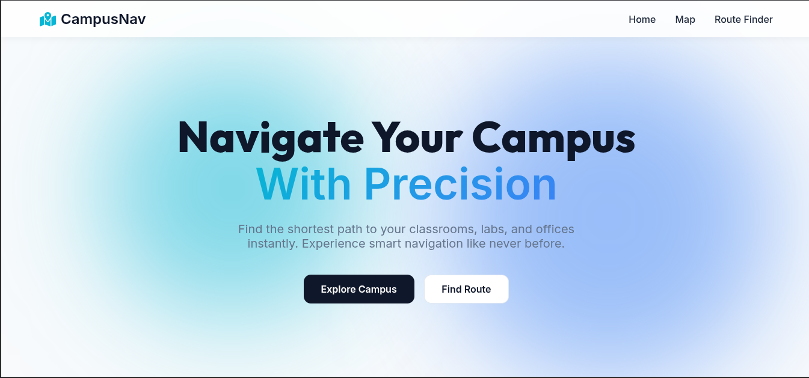
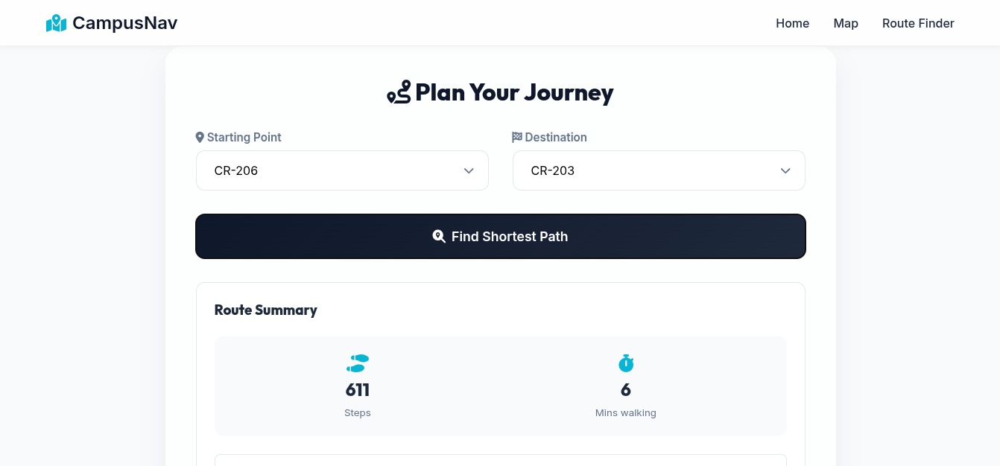
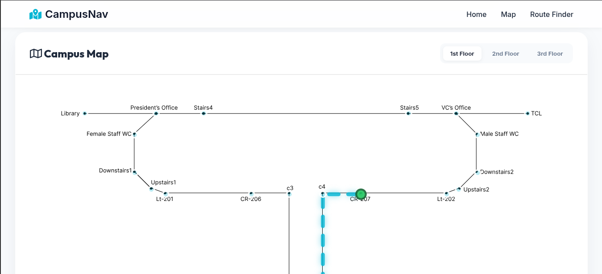
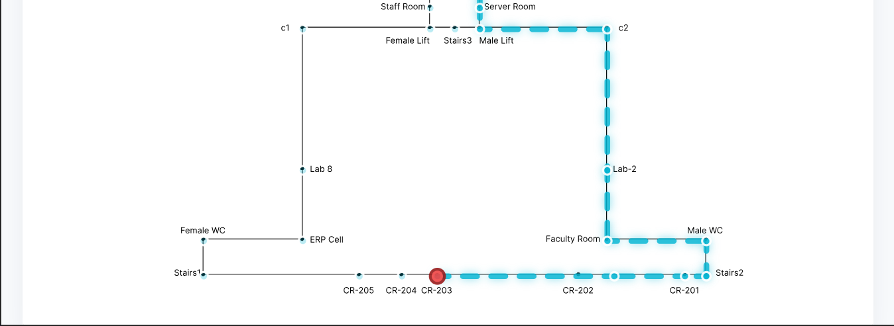

# 🧭 Smart Campus Navigator

A web-based campus navigation system that helps students, faculty, and visitors find the shortest route between locations inside the university campus.

The application models the campus as a graph and uses **Dijkstra's Algorithm** to calculate the shortest path between classrooms, laboratories, offices, libraries, staircases, and other facilities. The computed route is displayed visually on an interactive campus map along with route statistics.

---

## ✨ Features

* 🗺️ Interactive campus map visualization
* 📍 Select source and destination locations
* 🚶 Shortest path computation using Dijkstra's Algorithm
* 🏢 Support for classrooms, labs, offices, lifts, staircases, and facilities
* 🧩 Multi-floor campus navigation
* 📊 Route summary with distance and estimated walking time
* 🎨 Modern and responsive user interface
* ⚡ Real-time path visualization

---

# 🖥️ Application Screenshots

## Home Page



The landing page provides quick access to campus exploration and route planning features.

---

## Route Finder



Users can select a starting point and destination to instantly generate the shortest path across the campus.

---

## Interactive Campus Map

## Interactive Campus Map

<p align="center">
  
  
</p>

The campus is represented as a graph of interconnected locations including classrooms, laboratories, offices, staircases, lifts, and facilities. Routes are highlighted directly on the map for intuitive navigation.

The campus is represented as a graph of interconnected locations including classrooms, laboratories, offices, staircases, lifts, and facilities. Routes are highlighted directly on the map for intuitive navigation.

---

# 🏗️ System Architecture

```text
User Input
     │
     ▼
Select Source & Destination
     │
     ▼
Campus Graph Construction
     │
     ▼
Dijkstra's Algorithm
     │
     ▼
Shortest Path Calculation
     │
     ▼
Route Visualization
     │
     ▼
Navigation Guidance
```

---

# ⚙️ Tech Stack

| Category          | Technology             |
| ----------------- | ---------------------- |
| Frontend          | HTML, CSS, JavaScript  |
| Backend           | Java                   |
| Algorithm         | Dijkstra's Algorithm   |
| Data Structure    | Graph (Adjacency List) |
| Development Tools | VS Code, JDK           |

---

# 🔍 How It Works

### Campus Modeling

The university campus is modeled as a weighted graph:

* **Nodes** represent campus locations
* **Edges** represent walkable paths
* **Weights** represent distances between locations

### Route Generation

1. User selects a source location
2. User selects a destination
3. The graph is loaded into memory
4. Dijkstra's Algorithm computes the shortest path
5. Route information is returned
6. The path is highlighted on the campus map
7. Distance and navigation statistics are displayed

---

# 🧠 Dijkstra's Algorithm

The system uses **Dijkstra's Algorithm** to compute the shortest path between two campus locations.

### Why Dijkstra?

* Guarantees shortest path results
* Efficient for campus-sized navigation graphs
* Handles weighted connections accurately
* Widely used in real-world navigation systems

### Time Complexity

```text
O((V + E) log V)
```

Where:

* **V** = Number of Locations
* **E** = Number of Connections

---

# 📂 Project Structure

```text
Smart-Campus-Navigator/
│
├── frontend/
│   ├── index.html
│   ├── map.html
│   ├── routefinder.html
│   ├── css/
│   └── js/
│
├── backend/
│   ├── Graph.java
│   ├── Dijkstra.java
│   └── Navigator.java
│
├── images/
│   ├── home.png
│   ├── 2.png
│   ├── m1.png
│   └── m2.png
│
└── README.md
```

---

# 🚀 Getting Started

## Clone the Repository

```bash
git clone https://github.com/JustAnoobCat/Smart-Campus-Navigator.git
```

## Navigate to Project Directory

```bash
cd Smart-Campus-Navigator
```

## Run the Application

1. Start the Java backend.
2. Launch the frontend in your browser.
3. Open the Route Finder page.
4. Select source and destination locations.
5. View the computed shortest route on the campus map.

---

# 🎯 Educational Objectives

This project was developed to demonstrate:

* Graph Data Structures
* Dijkstra's Algorithm
* Pathfinding Systems
* Frontend-Backend Integration
* Interactive Data Visualization
* Real-World Problem Solving

---

# 👨‍💻 Team Members

* **Aarush Mandoliya** - Frontend Development, Graph Modeling, Route Visualization
* **Mansi** - Campus Mapping, Testing, Documentation
* **Karan Singh Chauhan** - Backend Development, Pathfinding Logic

---

# 🔮 Future Enhancements

* [ ] A* Pathfinding Algorithm
* [ ] Mobile Responsive Version
* [ ] Accessibility-Friendly Routes
* [ ] QR-Based Location Detection
* [ ] Voice-Guided Navigation
* [ ] Search-Based Location Finder
* [ ] Real-Time Crowd Analysis
* [ ] Indoor Position Tracking

---

# 📄 License

This project is licensed under the MIT License.

---

Built to make campus navigation smarter, faster, and more accessible for students, faculty, and visitors.
